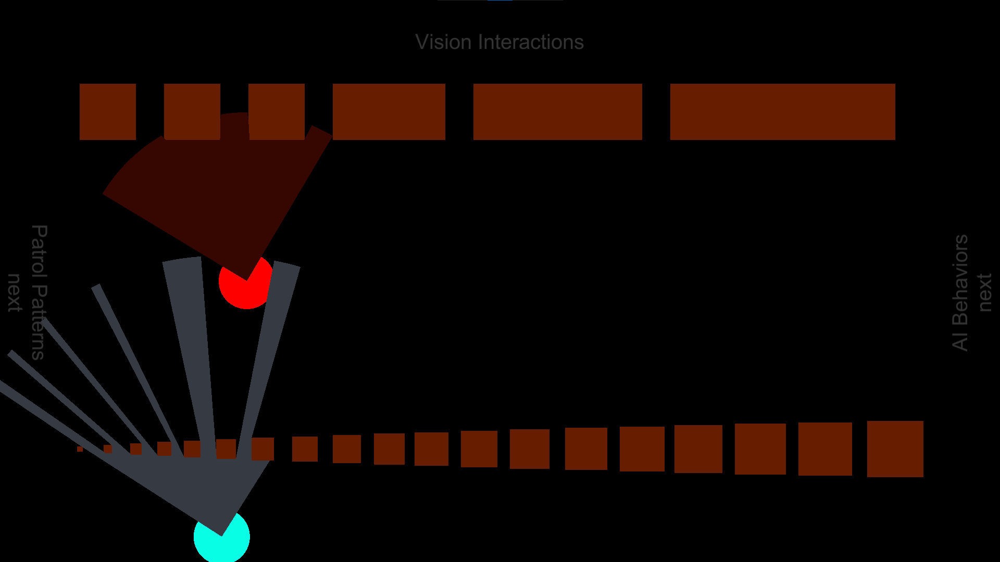
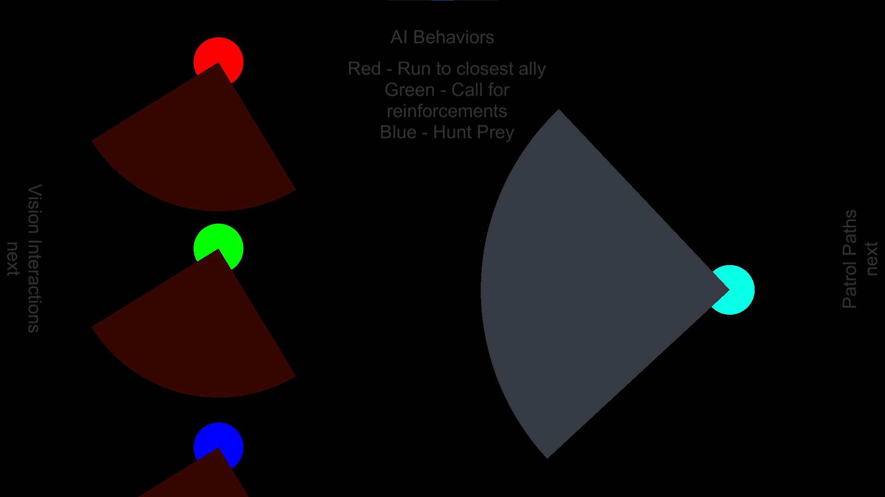
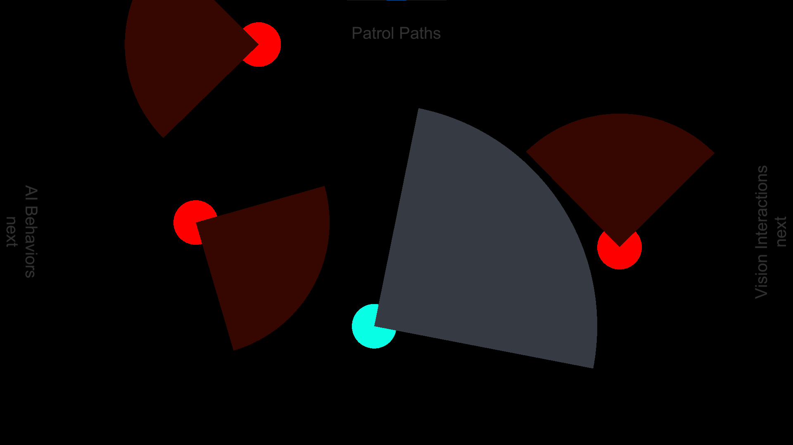

# 2D-Field-of-View
An implementation of a 2D FOV and detection mechanic for top-down stealth games. Did the first version in 2018 using Unity 2018.3 and later updated it to Unity 2020.3. This is a project to test a 2D stealth game mechanic and does not mean to be a game at all. There are three scenes, one for each test:
- Test vision interactions with the Player, Enemy, and Objects.
- Some AI Behavior based on this FOV mechanic.
- Some Patrol and patrol paths to view how AI movement interacts with FOV

**Vision Interactions:** 

**AI Behaviors:** 

**Patrol Paths:** 
